<div align="center">

# LifeTracker

**All-in-one personal productivity dashboard — habits, budget, workouts, goals, time tracking, Pomodoro, and investments in one offline-first app.**

[](https://github.com/ReinaXGT/LifeTracker/stargazers)
[](https://github.com/ReinaXGT/LifeTracker/commits/main)
[](LICENSE)
[](https://github.com/ReinaXGT/LifeTracker)
[](https://github.com/ReinaXGT/LifeTracker)

</div>

---

> **Zero dependencies, zero backend, zero account.**  
> Open `index.html` in your browser and start. Everything is stored locally in `localStorage`.

---

## Screenshots

### Dashboard
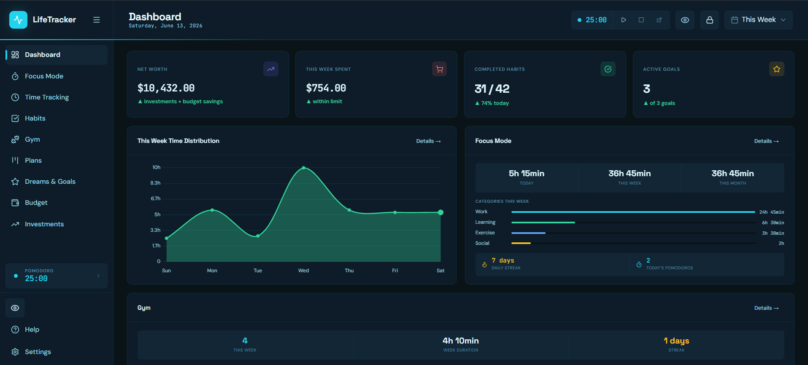

### Focus Mode (Pomodoro)
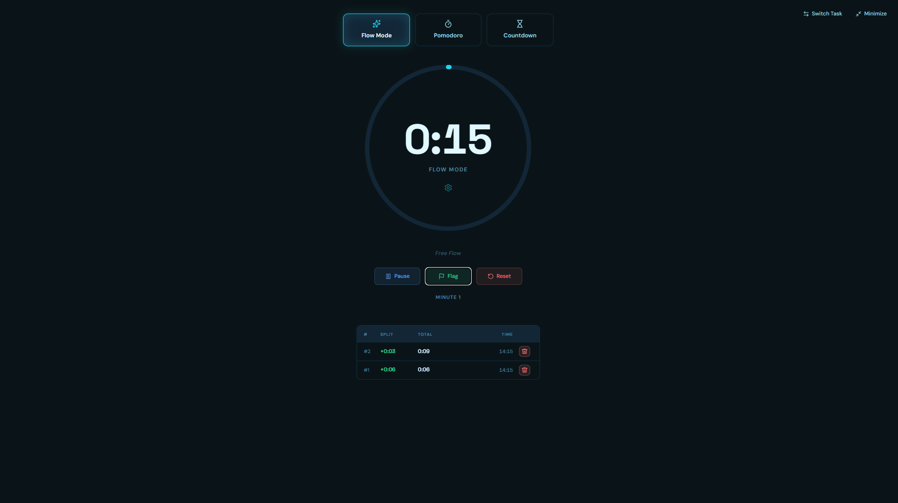
<details>
<summary>More Pomodoro views</summary>

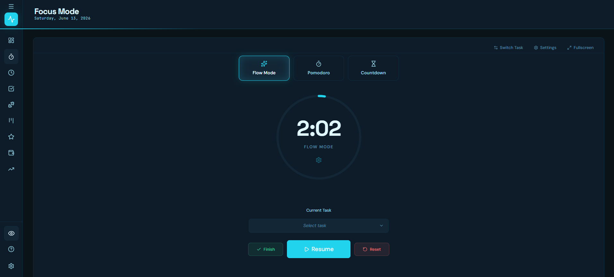
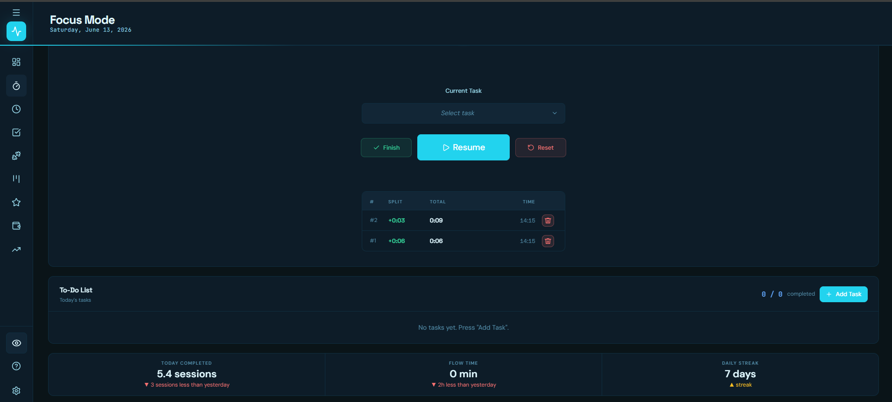
</details>

### Time Tracking
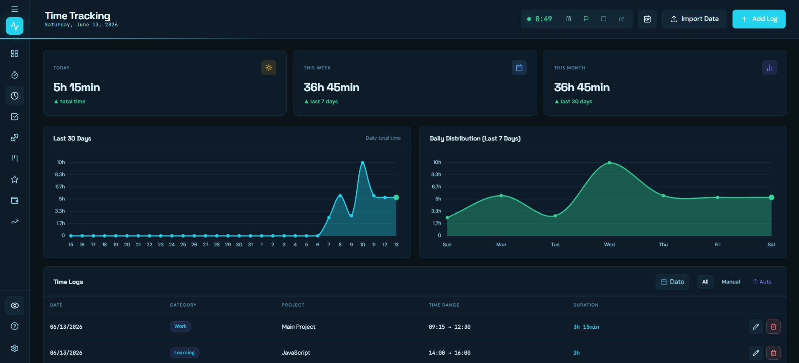

### Habits
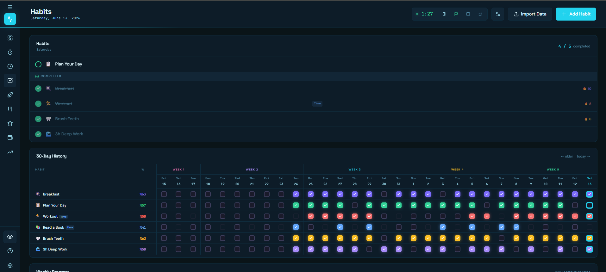

### Gym
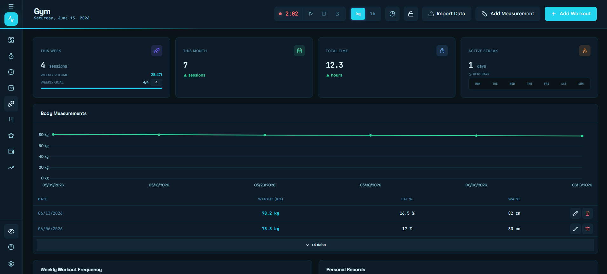

### Plans
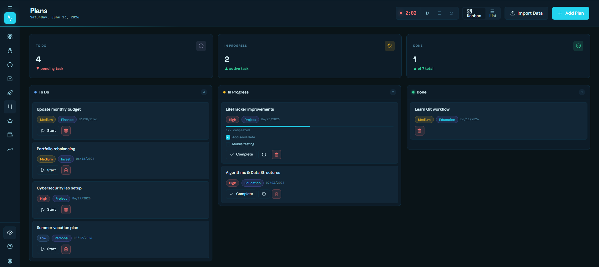

### Goals
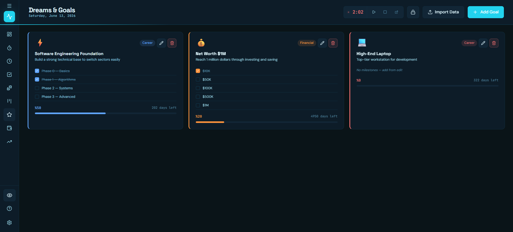

### Budget
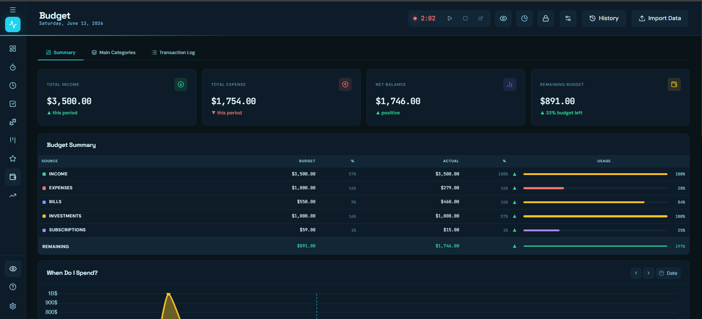

### Investments
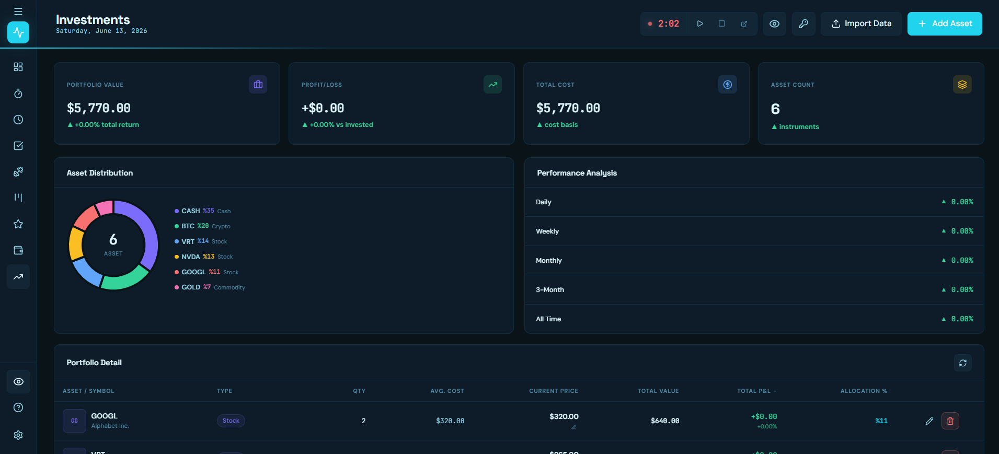

---

## Modules

| Module | Page | Description |
|--------|------|-------------|
| **Dashboard** | `index.html` | At-a-glance summary of all modules with draggable panels and period selector |
| **Focus Mode** | `pomodoro.html` | Pomodoro / Flow / Countdown timer with to-do list, flag splits, fullscreen, and Web Worker |
| **Time Tracking** | `time.html` | Daily time log with category & project tracking and 30-day charts |
| **Habits** | `habits.html` | Daily and scheduled habit tracking with streaks, 30-day heatmap, and weekly donuts |
| **Gym** | `gym.html` | Workout tracker with 1RM calc, templates, body measurements, and progress charts |
| **Plans** | `plans.html` | Kanban board (To-Do / In Progress / Done) with multi-line sub-tasks |
| **Goals** | `goals.html` | Dream and milestone management with category tags and progress bars |
| **Budget** | `budget.html` | Income/expense categories, budget cycles, draggable/resizable panels |
| **Investments** | `investments.html` | Portfolio tracker — stocks, ETFs, crypto, commodities with live prices |

---

## Features

### Why LifeTracker?

Most productivity apps require an account, phone number, or monthly subscription. LifeTracker runs entirely in your browser with no server, no account, no tracking, and no internet connection required (except for optional live investment prices).

### Global
- **All data in `localStorage`** — works fully offline, private by default
- **12 themes:** Dark, Midnight, Ocean, Forest, Sunset, Rose, Amber, Crimson, Nebula, Arctic, Neon, White
- **5 languages:** Turkish 🇹🇷, English 🇬🇧, Simplified Chinese 🇨🇳, Spanish 🇪🇸, French 🇫🇷
- **UI scale:** 60%–140% slider — every element scales proportionally
- **Privacy mode** — mask all financial values with a single click
- **Sidebar collapse** — icon-only mode for more screen space
- **Full JSON backup** — export, import, and restore everything
- **Per-page panel manager** — show/hide and reorder dashboard panels
- **Responsive** — desktop (1280px+) and mobile (≤768px)

### Focus Mode (Pomodoro)
- Three timer modes: **Pomodoro** (work/break cycles), **Flow** (unlimited + lap flags), **Countdown** (custom duration)
- **Flag button** — mark split points mid-session; records elapsed time and clock time
- **Reset options** — save to last flag / rewind to last flag / hard reset
- **Finish button** — save full session or split by flags into separate log entries
- Integrated to-do list with subtasks and categories
- Overtime mode (`+MM:SS` after time runs out)
- Fullscreen mode — hides all UI chrome
- **Web Worker** keeps timer accurate even in background tabs (no throttling)
- Cross-tab sync via `BroadcastChannel`
- State persists across page reloads (8-hour TTL)

### Habits
- **Permanent** (every day) and **scheduled** (specific weekdays) habit types
- Skip system — mark a day as skipped without breaking your streak
- 🔥 Streak counter per habit
- 30-day completion heatmap
- Weekly completion donut charts

### Gym
- Workout types: Strength, Cardio, Flexibility, CrossFit, Sport, Other
- Per-exercise personal records (max weight tracking)
- **1 Rep Max (1RM)** auto-calculation
- Workout templates for quick reuse
- Body measurement tracking (chest, waist, hips, etc.)
- kg / lb toggle — all data converts automatically

### Plans
- Kanban and list views (sortable by due date)
- Sub-tasks with inline editing, multi-line text, and drag-and-drop reordering
- Priority levels: High / Medium / Low
- Category tags and due date alerts (red when overdue)

### Budget
- 3-tab layout: **Overview** (KPIs + charts), **Categories** (structure), **Transactions** (all entries)
- Hierarchical categories (group → sub-category) with color coding and budget limits
- **Budget cycles** — resets on a configurable day each month; all past cycles archived
- Net savings chart (12-month slots)
- Draggable, resizable panels

### Investments
- Asset types: Stock, ETF, Crypto, Commodity, Bond, Cash
- Live price feeds via **Alpha Vantage API** (24-hour cache)
- Exchange rate via **Exchange Rates API** (2-hour cache)
- P&L by period: total, daily, weekly, monthly
- USD / local currency display toggle

---

## Getting Started

No installation, no build step, no Node.js required.

```bash
# Option 1 — Python
python -m http.server 8080

# Option 2 — Node
npx serve .

# Option 3 — just open index.html directly in your browser
```

Then open `http://localhost:8080` (or just double-click `index.html`).

---

## Tech Stack

- **Vanilla HTML / CSS / JavaScript** — no framework, no bundler, no transpiler
- [Chart.js v4.4.0](https://www.chartjs.org/) — bar, line, doughnut charts
- [Lucide Icons](https://lucide.dev/) — icon library
- [Google Fonts](https://fonts.google.com/) — Space Grotesk, DM Sans, JetBrains Mono

### Custom UI Components (no third-party UI library)

All native browser controls are replaced because their appearance breaks the active theme.

| Component | Purpose |
|-----------|---------|
| `CustomDropdown` | Themed dropdown replacing `<select>` |
| `CustomDatePicker` | Themed date picker replacing `<input type="date">` |
| `CustomTimePicker` | Themed time picker replacing `<input type="time">` |
| `CheckboxCore` | Themed checkboxes replacing `<input type="checkbox">` |
| `TooltipCore` | Themed tooltips replacing the native `title` attribute |
| `ColorPicker` | Themed color picker replacing `<input type="color">` |

---

## API Keys (optional — Investments module only)

Live price fetching requires external API keys. Enter them in **Settings → Investment API Keys**. They are stored only in your browser's `localStorage` and never sent anywhere else.

| API | Purpose | Free Tier |
|-----|---------|-----------|
| [Alpha Vantage](https://www.alphavantage.co/support/#api-key) | Stocks, ETFs, crypto prices | 25 req/day |
| [Exchange Rates API](https://exchangeratesapi.io/) | Currency conversion | 1,000 req/month |

All other modules work **100% offline** with no API keys.

---

## Project Structure

```
LifeTracker/
├── index.html              ← Dashboard
├── pomodoro.html
├── time.html
├── habits.html
├── gym.html
├── plans.html
├── goals.html
├── budget.html
├── investments.html
│
├── css/
│   ├── variables.css           ← Design tokens & all 12 themes
│   ├── layout.css              ← Sidebar, topbar, main layout
│   ├── components.css          ← Buttons, forms, cards, modals
│   ├── mobile.css              ← Responsive overrides (≤768px)
│   └── ...                     ← Component-specific styles
│
└── js/
    ├── store.js            ← All localStorage read/write (lt_ prefix)
    ├── ui.js               ← Shared helpers: modal, toast, i18n, themes
    ├── charts.js           ← Chart.js wrappers
    ├── focus-widget.js     ← Cross-page Pomodoro widget + tab title
    └── [page].js           ← One module per page
```

---

## Data Management

| Action | How |
|--------|-----|
| **Export** | Settings → Export → `lifetracker-backup-YYYY-MM-DD.json` |
| **Import** | Settings → Import → select JSON (existing data is **replaced**) |
| **Delete all** | Settings → Delete All Data |
| **Budget-only import** | Budget → Transactions tab → Import |

All persistent data uses the `lt_` key prefix and is excluded from any external requests.

---

## License

[Proprietary](LICENSE) — Personal use and viewing only. Copying, redistribution, and derivative works require written permission.

---

<div align="center">
<sub>Built with the assistance of <a href="https://claude.ai/code">Claude Code</a> · Designed by <a href="https://github.com/ReinaXGT">ReinaXGT</a></sub>
</div>
